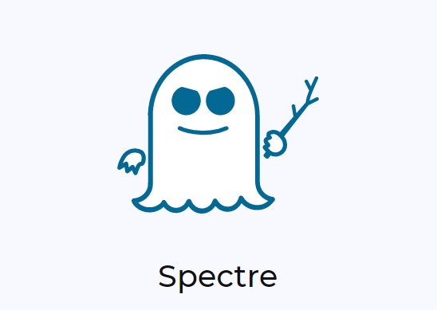

# Spectre attack



Spectre breaks the isolation between different applications. It allows an attacker to trick error-free programs, which follow best practices, into leaking their secrets. In fact, the safety checks of said best practices actually increase the attack surface and may make applications more susceptible to Spectre.

This exploit check your Linux (x64 only) for the spectre vulnerability.

# Compile

Just run `make` to compile the source code.

# Run

Execute the exploit 

```
taskset -c 1 ./exploit 

[+] Testing for Spectre
[+] Dumping memory from 0xffffffffffdfeea8 to 0xffffffffffdfeec2
[+] Dumped bytes match the expected value
[+] System vulnerable to spectre

```

# Authors

Spectre was independently discovered and reported by two people:

 * Jann Horn (Google Project Zero).
 * Paul Kocher in collaboration with, in alphabetical order, Daniel Genkin (University of Pennsylvania and University of Maryland), Mike Hamburg (Rambus), Moritz Lipp (Graz University of Technology), and Yuval Yarom (University of Adelaide and Data61).

# References

 * [Original Paper - Spectre Attacks: Exploiting Speculative Execution](https://spectreattack.com/spectre.pdf)
 * [The Intel 80x86 Processor Architecture: Pitfalls for Secure Systems](https://pdfs.semanticscholar.org/2209/42809262c17b6631c0f6536c91aaf7756857.pdf)
 * [Immunity: Intel CPU information Leak](https://www.immunityinc.com/downloads/x86leaks_old.pdf)
